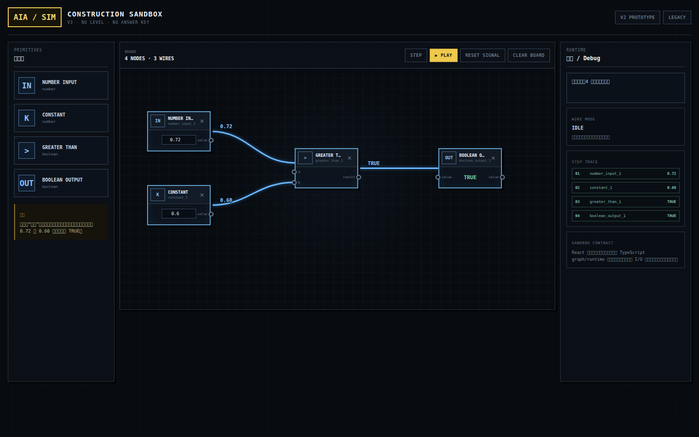
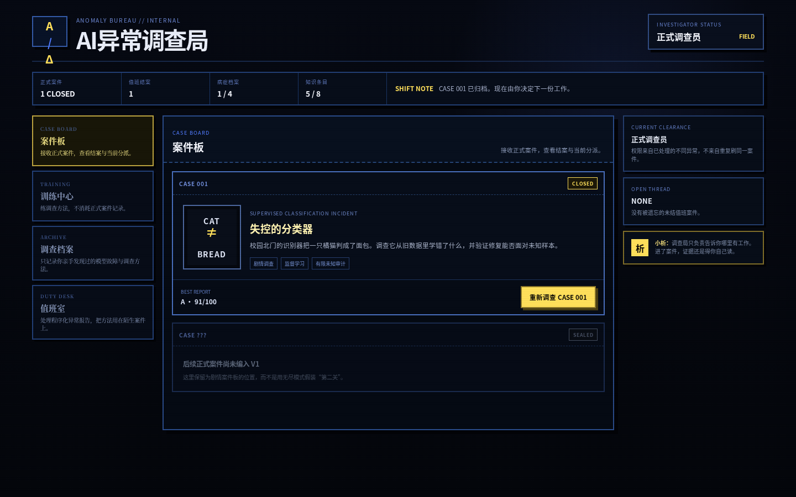
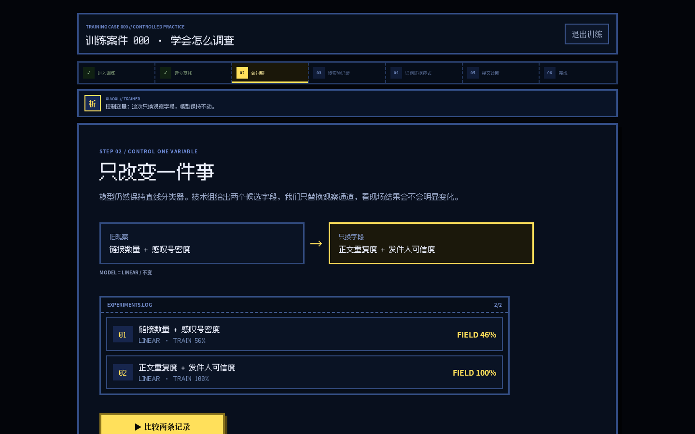
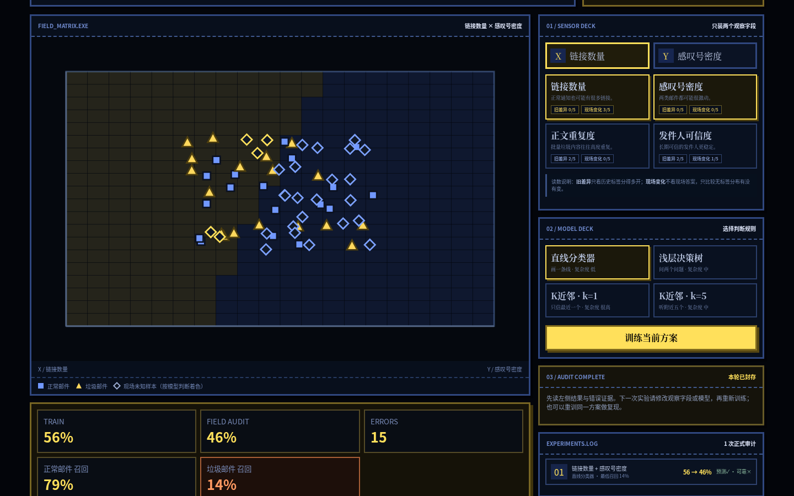
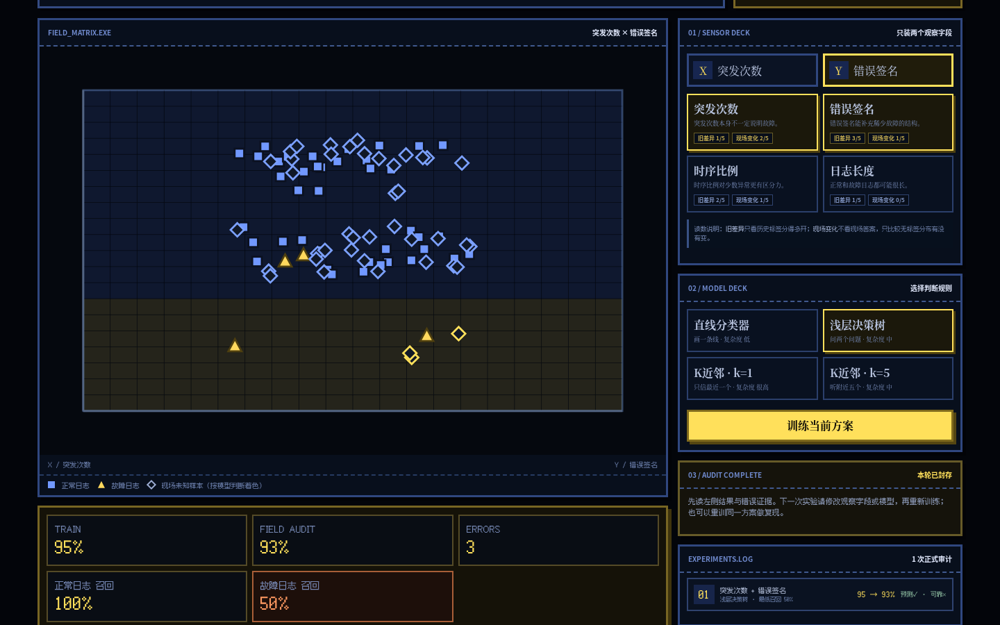

# AI异常调查局 · Simulator V3

> 当前主线已进一步下沉到 **Construction Sandbox**：先做一个本身可玩的系统构造模拟器，再从模拟器里长出教学关卡。V2 工作台和旧 CASE / Bureau / Duty 都保留为实验资产，但不再定义默认核心玩法。

<p align="center">
  <a href="https://siddhartha-yz.github.io/ai-anomaly-bureau/"><strong>▶ 在线试玩 / Live Demo</strong></a>
  ·
  <a href="docs/SIMULATOR_V3.md">Simulator V3</a>
  ·
  <a href="docs/V2_VERTICAL_SLICE.md">V2 Vertical Slice</a>
  ·
  <a href="docs/PRODUCT_DESIGN.md">产品设计</a>
  ·
  <a href="docs/GAME_ARCHITECTURE.md">游戏架构</a>
  ·
  <a href="docs/VALIDATION.md">验证记录</a>
</p>



## V3：先验证模拟器

默认入口现在是一张空白 Construction Board。除标量 primitive 外，已加入通用 boolean stream、逐项比较、计数、长度与除法 primitive；玩家自己放节点、拉 typed wire、改输入，再用 `PLAY / STEP` 看真实信号沿图传播。

没有 LEVEL、正确答案按钮，也没有 Accuracy / Recall 这类成品 ML 节点。除了标量阈值机，当前 `NUMBER STREAM → STREAM >` 已能让一串模型分数逐样本产生预测，再接低层 stream primitive 自己搭出 Accuracy-like 匹配比例，以及 `STREAM AND + COUNT TRUE + DIVIDE` 组成的 Recall-like 条件比例。玩家还可以选择一组节点保存为 Blueprint；Blueprint 保存内部拓扑，再次放入时复制真实节点/连线并保留边界端口，开始形成“我造的结构以后还能继续用”的构造循环。模拟器核心是独立纯 TypeScript graph/runtime，React 只负责编辑与可视化。详细边界见 [`docs/SIMULATOR_V3.md`](docs/SIMULATOR_V3.md)。

V2 工作台仍可通过 `?v2=1` 打开；旧剧情/Bureau/Duty 通过 `?legacy=1` 打开。

## V2 / Legacy V1

下面内容记录此前 CASE 001 → CASE 005 → Bureau → Duty 的 V1 设计与实现，仍由完整自动测试保护，便于复用其中的数据、模型和内容资产。它不再是默认玩家体验。

### 旧版 30 秒理解玩法

你接手一台校园流浪动物识别机器人。它非常自信——也非常离谱：**一只橘猫被识别成了面包。**

游戏不会先讲公式。你先在事故录像里亲手确认“这明明是一只猫”，再进入终端调查：

```text
亲眼看到 CAT ≠ BREAD
      ↓
翻旧样本 + 读取机器人当前的两项“视觉”
      ↓
第一次训练成功，并先下注：它真的修好了吗？
      ↓
没见过的新数据翻车
      ↓
调查两条真实误判，把证据串起来
      ↓
故意让 k=1 把训练集做到 100%
      ↓
自己解释反常现象 → 揭示“过拟合”
      ↓
解锁备用传感器，比较实验记录并重新设计
      ↓
让模型真正泛化到新样本
```


## 从新人案件到调查局

第一次进入时不会先给你一个空菜单：玩家以 **实习调查员** 身份直接接到 `CASE 001`。结案后才出现一次性 `CLEARANCE GRANTED`，正式开放 **AI异常调查局 Hub**：案件板保存手工剧情案，训练中心放 Boot Case，调查档案只点亮亲手遇到过的知识，值班室负责程序化异常报告。没有 XP、金币或重复刷关奖励；长期进度来自你处理过哪些不同故障。

值班室也不再是“进入另一个模式”的按钮：没有未结案时会同时收到 3 份只描述症状的 `INCOMING REPORTS`，玩家选择一份接案；已经归档的 seed 不会重新发回队列。有未结案件时，新报告不会静默覆盖旧进度。Hub 顶部的 `SHIFT PRIORITY` 只负责把你带回未结案、推荐训练或待处理部门，不会读取具体 syndrome / 实验结果替你解题；从训练中心或值班室进入任务后，退出也会回到原部门。

手工正式案件有唯一 `bureau/catalog.ts` 目录；当前登记 `CASE 001 → CASE 002 → CASE 003 → CASE 004 → CASE 005`，并通过前置关系逐宗开放。CASE 002/003/004/005 共用数据驱动的 authored-puzzle runtime，但各自拥有独立 checkpoint、真实计算和结案记录；训练案件仍单独登记，Duty 也不会被拿来冒充下一宗正式剧情关。



**Story Case 001 · 失控的分类器** 是有叙事节奏的新人入职案件。玩家不仅要训练模型，还要在图上抓异常旧样本、读取决策边界里的 `PROBE ?`、先锁定实验预测、调查两条误判、从 `CASE_NOTES.LOG` 指出反常实验，再解释为什么训练 100% 仍可能更差。错误判断不会立刻 Game Over，而会变成现场后果并影响最终调查评级。

正式案件都使用版本化浏览器本地检查点。CASE 001 恢复阶段、实验数和正式审计额度；CASE 002/003/004/005 的通用恢复页则显示 `CHECKS / REVISIONS`，不会假装每一案都有同一种资源。已经锁定但尚未执行的 CASE 001 实验预测也会恢复；短谜题会恢复当前谜题、选择与最近验证结果。若浏览器拒绝 localStorage 写入，游戏会明确显示 `LOCAL SAVE FAILED` 并提供“重试本地保存”，不会静默假装已经保存。

**Supervised Investigation · 无尽调查** 是可重复玩的程序化监督学习诊断模式。每个 seed 会重排传感器通道、生成不同案件语境，并从四类真实故障中产生一类：特征不足、训练噪声 / 过拟合、分布漂移、类别不平衡。训练免费，但正式未知审计只有 5 次；每次审计前必须先预测结果，最后还要提交病因。

第一次进入无尽调查不会直接掉进驾驶舱：短模式说明先解释“配置 → 预测 → 审计 → 对照 → 诊断”的循环，随后推荐完成 **Boot Case 000**。训练案件会亲手教一次控制变量、读取 `EXPERIMENTS.LOG`、识别训练满分 / 类别召回 / 环境变化等证据模式，以及“选择病因只是草稿，提交才会锁报告”。正式无尽模式随后撤掉这些解释，只保留一个 sticky `NEXT OBJECTIVE` 告诉玩家**下一步缺什么动作或证据**，不会告诉该选哪个字段、模型或病因。



正式案件的故障仍然存在于可观察世界里，但原因证据不再开局摊在桌上。第一次正式审计只负责复现事故；之后 `CASE_LEADS.LOG` 才解封三条不带病名的竞争原因：`H-COVERAGE`（历史覆盖是否偏）、`H-CONTEXT`（现场环境是否换了）、`H-RECORDS`（旧记录是否有质量问题）。玩家主动打开其中一份，才会看到精确类别构成、历史 / 现场批次或采集质量记录；查到“没有异常”同样是有价值的排除证据。三类来源即使出现 positive finding 也都不能直接等同于某个病名：其他案件可能同样带着真实但非主因的上游覆盖偏斜、运营批次变化或历史质量告警，必须再用受控实验判断这条事实有没有真正改变模型行为。

正式调查现在要求把推理真的写进案卷：现场误判可以点击并定位回 `FIELD_MATRIX`；fields-only / model-only 实验用来测试 `H-FIELDS / H-MODEL`，而病因命名还要求**至少杀掉一个竞争解释**。仅仅找到可靠方案或一条支持证据都不够：要么某份原因来源被事实明确排除，要么一个受控单变量预测几乎不起作用并把对应干预假设削弱。随后玩家还必须从 `EXPERIMENTS.LOG` 引用真正有区分力的实验记录；系统只生成客观变量 / 指标变化，不替玩家写病因。

无尽案件使用版本化浏览器本地 session 保存已经揭示的调查状态。刷新页面不会返还 5 次正式审计预算；离开后再进入会明确显示未结案件、已用审计与剩余额度。放弃旧案并生成新案件需要二次确认，存档只包含玩家已经取得的实验 / 证据，不保存未审计的隐藏测试标签。



无尽模式不只看 Accuracy：可靠方案要求总体未知准确率 ≥85%，且两类召回都 ≥75%。因此会出现“总体 93%，但少数类召回只有 50%，仍然不能结案”的陷阱。



## 为什么它不是普通 ML Demo

- **模型真的在浏览器里训练。** 线性分类器、深度 2 决策树、KNN k=1 / k=5 都由 TypeScript 实时计算。
- **测试集真的隐藏。** 普通玩家在审计前拿不到测试标签；不是先把答案塞进 UI 再演剧情。
- **过拟合是真的。** 固定 seed 下，k=1 会真实取得训练 100%，同时在未知数据上退步。
- **错误样本可以调查。** 不是只给一个 Accuracy；玩家必须调查两条不同误判并完成一次证据推理。
- **实验有成本。** 正式未知审计有额度；改模型 / 特征后必须重新下注，穷举不是零成本最优策略。
- **对照实验真的有价值。** `EXPERIMENTS.LOG` 会记录“只换字段 / 只换模型 / 两者都换 / 原样复现”，结案评级会评价实验设计质量，但不会阻止玩家自由试验。
- **诊断必须同时有支持与反证。** 找到可靠方案、取得一条显著对照都还不够；玩家至少要主动复核一份原因来源，并用 clean source 或 null-result 真正排除一个竞争解释，四个 syndrome 名称才出现。随后仍要明确引用区分性实验，错误诊断后下一份报告必须包含新增审计。
- **调查进度不会被 F5 洗掉。** 正式审计历史、额度、诊断锁与已检查证据按 seed 保存在本地；刷新恢复而不是重新发 5 次额度。
- **剧情长局也不会被 F5 清空。** Story Case 会恢复 reducer、微阶段、实验预注册、已调查误判与有限审计预算；checkpoint 会交叉核对阶段顺序、训练 / 审计 / CASE_NOTES / 额度关系，右上角小型 `RESET` 需要二次确认才真正清档。
- **真人测试日志能跨刷新连续。** 匿名行为日志沿用同一 sessionId，并显式记录 `SESSION_RESTORED`；普通玩家在 CASE CLOSED 就能直接导出完整 JSON，无需任何测试工具。
- **评价不只看总分。** 无尽模式还看两类召回，能制造“93% Accuracy 仍然不能上线”的类别不平衡案件。
- **先体验，再命名概念。** 玩家先遇到“旧题会、新题崩”，之后游戏才告诉你这叫泛化与过拟合；正式 Duty 也会先经历失败、核验竞争原因、取得支持与反证，再显示 syndrome 名称。
- **实验的价值是减少不确定性。** Duty 先复现真实故障 baseline，再让 `H-FIELDS / H-MODEL` 两条解释接受 fields-only / model-only 控制实验；一个聪明的 null result 也可以直接削弱错误解释，而不是只追最高分。
- **自动测试游戏深度。** 程序会比较 evidence-policy 与 random-clicker，并检查生成案件不能“开局已经修好”、必须存在 material single-variable experiment；当前平衡门槛要求证据策略结案率显著高于 5 次随机穷举。


## 你会亲手学到什么

| 玩家做的事 | 对应 ML 直觉 |
|---|---|
| 切换“颜色暖度 / 轮廓圆度 / 表面纹理 / 长宽比例” | 特征决定模型能看到什么 |
| 在散点扫描台观察两类样本 | 数据表示会影响问题难度 |
| 训练直线 / 树 / KNN | 模型复杂度并非越高越好 |
| 放入从未参与训练的新样本 | 测试集用于检查未知数据 |
| 点击黄色 `!` 调查误判 | 错误案例比单一分数更能定位问题 |
| 看到 k=1 的 100% → 翻车 | 过拟合与泛化 |
| 发现训练 / 验证出现同一物理实体 | 数据泄漏与切分单位 |
| 按物品实体重切分再比较模型 | 分组切分与真正独立的验证 |

## 固定 seed 下的真实教学结果

默认 seed：`20260809`

| 特征 | 模型 | 训练表现 | 未知测试表现 |
|---|---|---:|---:|
| 暖度 + 圆度 | 直线分类器 | 88.9% | 66.7% |
| 纹理 + 长宽比 | KNN k=1 | **100%** | 79.2% |
| 纹理 + 长宽比 | 直线分类器 | 88.9% | **100%** |
| 纹理 + 长宽比 | 浅层决策树 | 88.9% | **100%** |
| 纹理 + 长宽比 | KNN k=5 | 88.9% | **100%** |

这些数值来自真实模型计算，不是写死的剧情结果。

## 技术实现

- React 19 + TypeScript + Vite
- 无后端、无账号、无数据库、无外部 AI API
- SVG 像素化数据扫描台与实时决策区域
- 固定 seed PRNG，保证教学路线可复现
- reducer 状态机负责教学守卫与阶段推进
- 程序化 Web Audio 8-bit BGM / 音效
- Vitest：ML 核心、隐藏测试边界、状态机、调查评级、Duty 故障 baseline / 区分性单变量实验、无尽案件生成与 random-clicker 平衡基线
- Playwright：剧情完整路线、Story 检查点 / 显式恢复 / 预注册恢复 / 结案导出、作弊码正式检查点、Boot Case 000、Duty 竞争假设 / falsification / syndrome 延迟揭示、无尽证据引用 / 对照、可调查现场误判、session 恢复、错误诊断刷新锁、键盘 modal、窄屏桌面、额度恢复、分布变化、类别不平衡等真实浏览器路线
- GitHub Actions：lint + typecheck + unit test + build + E2E
- GitHub Pages：`main` 更新后自动构建部署，并用同一条 Playwright 流程验证生产站点

## 本地运行

要求 Node.js 24。

```bash
npm ci
npm run dev
```

然后打开 Vite 输出的本地地址。

首次标题页只承担 CASE 001 新人入职；正式入职后默认进入调查局 Hub，案件板会优先提示下一宗已解锁的手工案件，当前顺序为 CASE 002 → CASE 003 → CASE 004 → CASE 005。已有未结 Duty 会优先恢复；完成当前手工序列后，Training / Duty 才成为主要的练习与迁移入口。开发 / 复现时仍可以用 query 直接固定正式无尽 seed：

```text
http://localhost:5173/?mode=endless&seed=6000
```

### QA Test Bench / 测试作弊码

项目不再维护一套与正式游戏平行的 Debug UI。最省事的方式是在任意游戏 URL 后加 `qa=1`，右下角会出现 **QA BENCH / OPEN**；也可以按 **`**（Backquote）或 **Ctrl+Shift+K** 打开同一工作台。除了 CASE 001 各关键阶段，CASE 002/003/004/005 现在也能直接跳到阈值、稳定传感器、重切分、干净验证、概率校准、独立审计与风险政策等中间谜题；Bureau、Training、四类代表 Duty 和任意 Duty seed 仍保留。所有跳转继续先备份正式 `aia.*` 存档，测试结束可一键恢复。

**任何会改状态的测试跳转都会先自动备份当前所有 `aia.*` 正式存档。** 之后可以随便跳阶段、切 seed，甚至点“全新用户状态”；页面右下角会持续显示 `QA TEST / SAVE SAFE`。测试结束点“恢复原存档并结束测试”，工作台会先清除测试产生的游戏存档，再逐字恢复原快照并返回开始测试时的 URL。手敲旧作弊码也自动走这层保护；只有 `HELP` 不创建快照。

快速入口底层仍然生成合法正式 checkpoint / 打开正式 runtime，不会直接硬改 stage，也不会绕过审计额度、刷新恢复或 session validator。常用原始命令仍保留：

```text
CASE001 ERRORS
CASE001 OVERFIT
CASE001 REPAIR
CASE001 FINAL
CASE001 CLOSED
CASE002
CASE003
CASE004
BUREAU UNLOCK
TRAINING
DUTY 6003
```

例如 `CASE001 OVERFIT` 会真实重建前两次训练 / 审计与 `CASE_NOTES.LOG`，再进入正式 `overfit_reveal`，而不是把 stage 字符串硬改过去。`DUTY <seed>` 会清掉该 seed 的测试 session 后打开真正的程序化案件；工作台的“任意 DUTY SEED”只是这条命令的人性化入口。历史 `?debug=1` query 已无特殊权限，也不会显示隐藏测试真值。普通玩家在 CASE CLOSED 仍可主动导出本局匿名行为日志用于真人测试反馈。

## 验证

```bash
npm run lint
npm run typecheck
npm test -- --run
npm run build
npm run test:e2e
```

Playwright E2E 会在真实 Chromium 中完成剧情整案：Cold Open → 图上抓异常旧样本 → 读取传感器 → 读 `PROBE ?` 决策边界 → 先预测再审计 → 错误上线后果 → 两条误判证据 → 指认反常实验 → k=1 过拟合 → 备用传感器修复 → 最终判断 → `CASE CLOSED`。此外还覆盖作弊码生成正式检查点、无尽模式证据诊断，以及“总体高分但少数类召回失败”的类别不平衡路线。

详细结果见 [`docs/VALIDATION.md`](docs/VALIDATION.md)。

## 文档

- [`docs/PRODUCT_DESIGN.md`](docs/PRODUCT_DESIGN.md) — 产品与教学目标
- [`docs/GAME_ARCHITECTURE.md`](docs/GAME_ARCHITECTURE.md) — 调查局 Hub、四层循环、meta progression 与新内容接入规则
- [`docs/TECHNICAL_DESIGN.md`](docs/TECHNICAL_DESIGN.md) — ML、状态机、作弊码与测试设计
- [`docs/VALIDATION.md`](docs/VALIDATION.md) — 固定 seed 指标、浏览器验证与发布验收

## 当前内容边界

当前手工内容已经形成 `CASE 001 → 002 → 003 → 004 → 005` 五案梯度，但仍保持无账号、无排行榜、无养成、无大模型 NPC、无后端服务。新增正式案件不按“再讲一个术语”的章节方式堆叠：每案只加入少量可以操作和验证的新原语，下一案必须复用旧方法。**监督学习 Duty** 继续承担陌生情境迁移和重复练习，而不是替代手工关卡数量。

## License

[MIT](LICENSE) © 2026 siddhartha-yz
