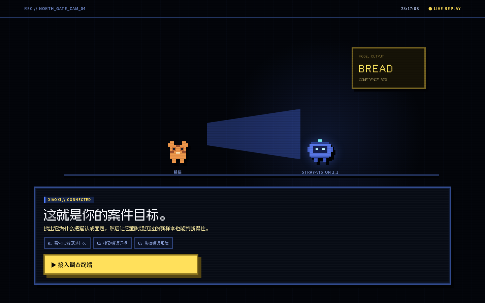
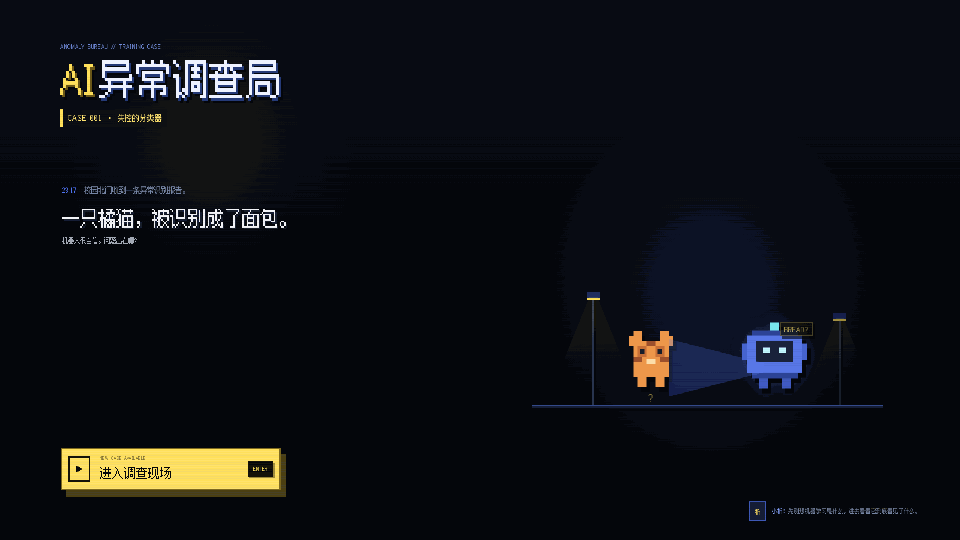
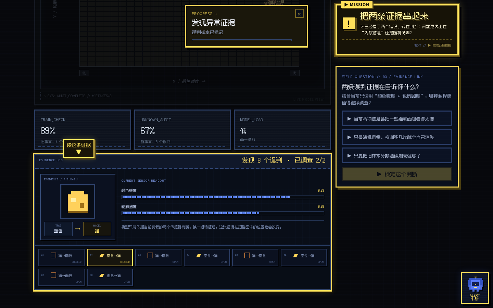

# AI异常调查局：失控的分类器

> 一款给机器学习零基础新生玩的浏览器调查游戏：先把橘猫认成面包的机器人“修好”，再亲手发现为什么 **训练集 100% 也可能是坏消息**。

<p align="center">
  <a href="https://siddhartha-yz.github.io/ai-anomaly-bureau/"><strong>▶ 在线试玩 / Live Demo</strong></a>
  ·
  <a href="docs/PRODUCT_DESIGN.md">产品设计</a>
  ·
  <a href="docs/VALIDATION.md">验证记录</a>
</p>



## 30 秒理解玩法

你接手一台校园流浪动物识别机器人。它非常自信——也非常离谱：**一只橘猫被识别成了面包。**

游戏不会先讲公式，而是让你直接经历这条认知反转：

```text
第一次训练成功
      ↓
没见过的新数据翻车
      ↓
点击并调查真实误判
      ↓
训练集 100%，未知数据仍失败
      ↓
发现“过拟合”
      ↓
重新选择特征 / 模型
      ↓
让模型真正泛化到新样本
```



## 为什么它不是普通 ML Demo

- **模型真的在浏览器里训练。** 线性分类器、深度 2 决策树、KNN k=1 / k=5 都由 TypeScript 实时计算。
- **测试集真的隐藏。** 普通玩家在审计前拿不到测试标签；不是先把答案塞进 UI 再演剧情。
- **过拟合是真的。** 固定 seed 下，k=1 会真实取得训练 100%，同时在未知数据上退步。
- **错误样本可以调查。** 不是只给一个 Accuracy；玩家必须至少打开一个误判证据。
- **先体验，再命名概念。** 玩家先遇到“旧题会、新题崩”，之后游戏才告诉你这叫泛化与过拟合。



## 你会亲手学到什么

| 玩家做的事 | 对应 ML 直觉 |
|---|---|
| 切换“颜色暖度 / 轮廓圆度 / 表面纹理 / 长宽比例” | 特征决定模型能看到什么 |
| 在散点扫描台观察两类样本 | 数据表示会影响问题难度 |
| 训练直线 / 树 / KNN | 模型复杂度并非越高越好 |
| 放入从未参与训练的新样本 | 测试集用于检查未知数据 |
| 点击黄色 `!` 调查误判 | 错误案例比单一分数更能定位问题 |
| 看到 k=1 的 100% → 翻车 | 过拟合与泛化 |

## 固定 seed 下的真实教学结果

默认 seed：`20260809`

| 特征 | 模型 | 训练表现 | 未知测试表现 |
|---|---|---:|---:|
| 暖度 + 圆度 | 直线分类器 | 88.9% | 66.7% |
| 纹理 + 长宽比 | KNN k=1 | **100%** | 79.2% |
| 纹理 + 长宽比 | 直线分类器 | 88.9% | **100%** |
| 纹理 + 长宽比 | 浅层决策树 | 88.9% | **100%** |
| 纹理 + 长宽比 | KNN k=5 | 88.9% | **100%** |

这些数值来自真实模型计算，不是写死的剧情结果。

## 技术实现

- React 19 + TypeScript + Vite
- 无后端、无账号、无数据库、无外部 AI API
- SVG 像素化数据扫描台与实时决策区域
- 固定 seed PRNG，保证教学路线可复现
- reducer 状态机负责教学守卫与阶段推进
- 程序化 Web Audio 8-bit BGM / 音效
- Vitest：ML 核心、隐藏测试边界、状态机、六类自动人格路线
- Playwright：Chromium 完整玩家 happy path
- GitHub Actions：lint + typecheck + unit test + build + E2E
- GitHub Pages：`main` 更新后自动构建部署，并用同一条 Playwright 流程验证生产站点

## 本地运行

要求 Node.js 24。

```bash
npm ci
npm run dev
```

然后打开 Vite 输出的本地地址。

开发者模式：

```text
http://localhost:5173/?debug=1&seed=20260809
```

Debug 模式提供阶段跳转、隐藏标签、模型参数、决策网格、六类自动路线与匿名行为日志导出；普通玩家模式不会暴露这些信息。

## 验证

```bash
npm run lint
npm run typecheck
npm test -- --run
npm run build
npm run test:e2e
```

Playwright E2E 会在真实 Chromium 中完成：进入游戏 → 选择特征 / 模型 → 训练 → 未知审计失败 → 查看误判 → 故意触发 k=1 过拟合 → 修复 → 迁移问题 → `CASE CLOSED`。

详细结果见 [`docs/VALIDATION.md`](docs/VALIDATION.md)。

## 文档

- [`docs/PRODUCT_DESIGN.md`](docs/PRODUCT_DESIGN.md) — 产品与教学目标
- [`docs/TECHNICAL_DESIGN.md`](docs/TECHNICAL_DESIGN.md) — ML、状态机、Debug 与测试设计
- [`docs/VALIDATION.md`](docs/VALIDATION.md) — 固定 seed 指标、浏览器验证与发布验收

## V1 的克制范围

V1 只有这一条完整单人垂直切片。它刻意不加入第二关、账号、排行榜、养成、大模型 NPC、神经网络训练或后端服务；目标是把一次“成功 → 翻车 → 过拟合 → 修复”的学习体验做完整。

## License

[MIT](LICENSE) © 2026 siddhartha-yz
